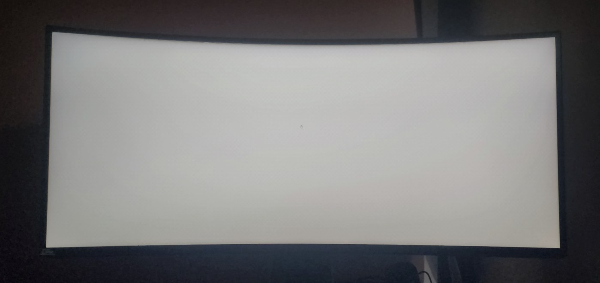
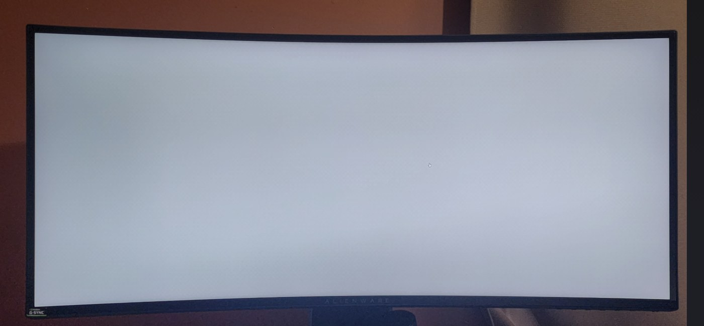

# Monitor Backlight Balance

A desktop-wide, click-through overlay that evens out **backlight bleed, clouding, and uniformity problems on LCD monitors** — by dimming the *good* parts of the panel to match the bad ones.

Written in AutoHotkey v2. No drivers, no injection, no admin rights.

> **The conventional wisdom is that software cannot fix backlight bleed.** That's true in the strict sense — you can't add light to a dead corner. But you *can* subtract light everywhere else, and a smooth per-pixel gradient makes the panel look uniform again. That's all this does.

---

## Why this exists

Existing options don't cover the Windows desktop:

| Tool | Limitation |
|---|---|
| ReShade uniformity shaders | Only inside games/apps ReShade injects into |
| BetterDisplay | macOS only, built-in displays only |
| Monitor OSD "Uniformity Compensation" | Only on some high-end panels |
| Generic screen dimmers | Uniform dimming — can't target a region |

This runs on the whole desktop, all the time, on any monitor.

---

## Before / after

Full-screen white, photographed in a dark room. Same panel, same monitor brightness.

**Before** — the lower right is dim and visibly yellow:



**After** — the healthy areas are pulled down to match, and the yellow cast is neutralized:



Measured across an 18-cell grid on the panel interior, yellowness variation drops from a
range of 40 to 14, and brightness standard deviation from 10.8 to 8.7. The remaining
brightness spread is mostly lens vignetting in the photo rather than the panel.

*(Phone camera, handheld, so treat the numbers as indicative rather than lab-grade.)*

## What it looks like

The overlay is a full-screen layered window with a **per-pixel alpha gradient**:

```
        left ──────────────────────────► right
 top     70    70    70    70    70    70    68     ← darkest (healthy panel)
         57    61    63    64    59    53    46
         39    45    47    49    42    34    26
         20    25    28    30    22    15     9
 bottom   7     7     7     7     7     7     7     ← untouched (the stain)
```

Everything is smoothly interpolated and dithered, so there are no visible bands.

---

## Features

- **Per-pixel gradient overlay** — a spline-defined boundary plus a smooth falloff, not a flat dim
- **Yellow-tint compensation** — backlight-dead areas usually go *yellow*, not just dark. The overlay subtracts red and green while leaving blue alone in those regions, neutralizing the cast
- **Ordered dithering** — 4×4 Bayer matrix breaks up the banding you get from 8-bit alpha over a 1440px-tall screen
- **Fully click-through** — `WS_EX_TRANSPARENT`, so mouse and keyboard pass straight through
- **Hotkey toggle** — `Ctrl+Alt+O`
- **Startup registration** — one click in the tray menu

---

## Install

**Option A — run the script**

1. Install [AutoHotkey v2](https://www.autohotkey.com/)
2. Download `monitor-backlight-balance.ahk`
3. Double-click it

**Option B — build a standalone .exe**

```
Ahk2Exe.exe /in monitor-backlight-balance.ahk /out MonitorBacklightBalance.exe /base AutoHotkey64.exe
```

Then right-click the tray icon → **Run at startup**.

---

## Calibrating for *your* panel

The defaults are tuned for one specific Alienware AW3418DW. **You will need to retune them.** See [docs/CALIBRATION.md](docs/CALIBRATION.md) for the full walkthrough — it takes about ten minutes.

Short version:

1. Display a full-screen white image, turn off the room lights
2. Photograph the screen straight-on with your phone
3. Look at where the panel is dim/yellow — that region gets **no** correction
4. Edit `gradPoints` so the boundary line traces the top edge of that region
5. Tune `maxAlpha` until the healthy area matches the dead area

All the knobs live in one clearly marked block at the top of the script:

```autohotkey
maxAlpha     := 70      ; strongest dimming, 0-255
minAlpha     := 7       ; floor applied even inside the stain
falloffDepth := 0.80    ; how far the gradient ramps, in screen heights
yellowFix    := 8       ; blue-tint strength to cancel yellowing, 0 = off
gradScale    := 5       ; compute resolution divisor (lower = finer, slower start)
dither       := true

gradPoints := [         ; the "no correction below this line" boundary
    {x: 0.00, y: 0.88},
    {x: 0.15, y: 0.94},
    ...
]
```

---

## How it works

1. An alpha map is computed at reduced resolution (screen ÷ `gradScale`) into a 32-bit top-down DIB section.
2. For each pixel, the vertical distance above the `gradPoints` boundary spline is run through a smoothstep to get an alpha value.
3. A 4×4 Bayer dither offset is added before rounding to an integer, killing gradient banding.
4. The yellow fix writes a **premultiplied blue** value equal to `fix`, with total alpha `alpha + fix`. Compositing then gives:
   - R, G reduced by `alpha + fix`
   - B reduced by `alpha`
   - → a net blue shift of `fix`, without touching areas that are already dimmed
5. The low-res bitmap is scaled up with `AlphaBlend` (which, unlike `StretchBlt`, preserves the alpha channel).
6. `UpdateLayeredWindow` with `ULW_ALPHA` pushes it to a `WS_EX_LAYERED | WS_EX_TRANSPARENT` window.

---

## Limitations

Be realistic about what this can and cannot do:

- **It only subtracts light.** Matching a dim corner means dimming the whole rest of the panel. You lose peak brightness.
- **The yellow fix costs brightness too.** Cancelling a yellow cast means cutting red and green further in that region.
- **On black content**, the yellow-fix region picks up a very faint blue tint (roughly RGB 0,0,8 at the default setting).
- **It does not fix black-level bleed** in dark scenes — an overlay can't make a leaking corner darker than black.
- **It's per-machine.** Every panel's defect is different; the shipped numbers will not match yours.

It works best on mid-tone and bright content, which is most desktop use.

---

## 한국어

중고로 산 모니터 우하단에 백라이트가 나가 누렇고 어두운 얼룩이 있어서, 나머지 멀쩡한 영역을 그만큼 깎아 균형을 맞추려고 만들었습니다.

- 화면 전체에 클릭 통과되는 반투명 오버레이를 띄우고, 픽셀마다 다른 농도를 계산해서 덮습니다
- 얼룩진 부분은 건드리지 않고, 멀쩡한 부분일수록 진하게 덮습니다
- 누런끼는 파랑을 남기고 빨강·초록만 더 깎아서 중화합니다
- 알파가 정수라 생기는 계단은 4×4 Bayer 디더링으로 흩뜨립니다

**주의: 기본값은 특정 모니터 한 대에 맞춘 값입니다.** 본인 모니터에 맞게 [docs/CALIBRATION.md](docs/CALIBRATION.md)를 보고 다시 잡으셔야 합니다.

단축키는 `Ctrl+Alt+O`(켜기/끄기), 트레이 아이콘 우클릭 → `Run at startup`으로 시작프로그램 등록, `Exit`으로 종료할 수 있습니다.

---

## License

MIT
